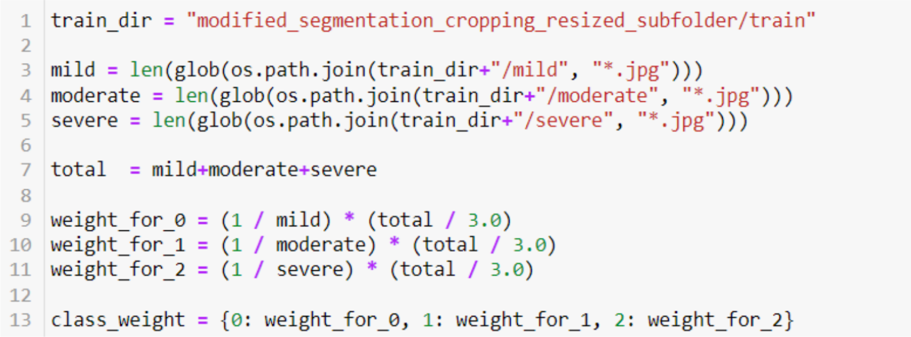
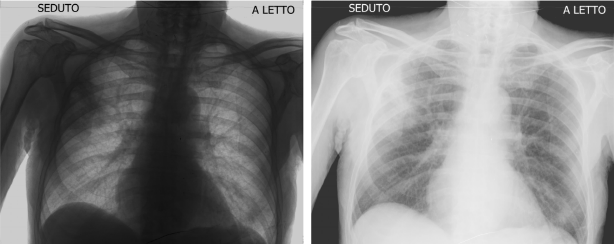
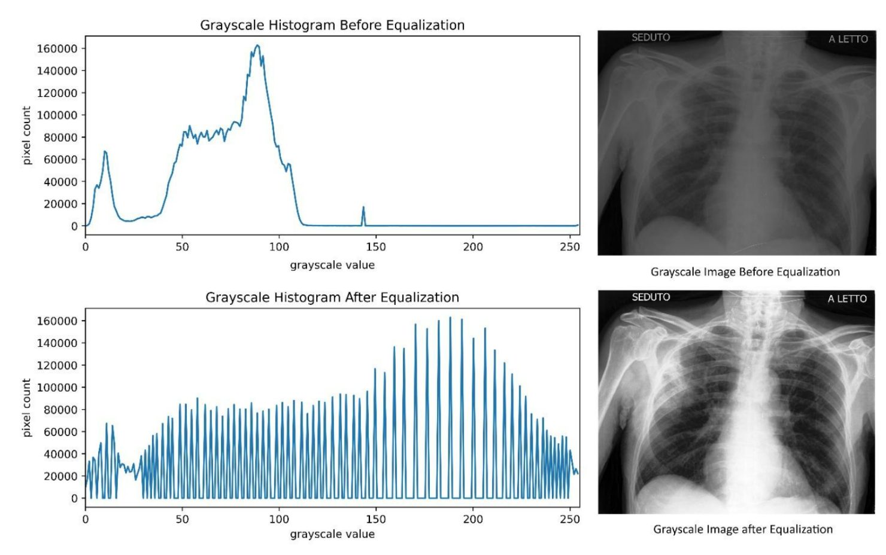
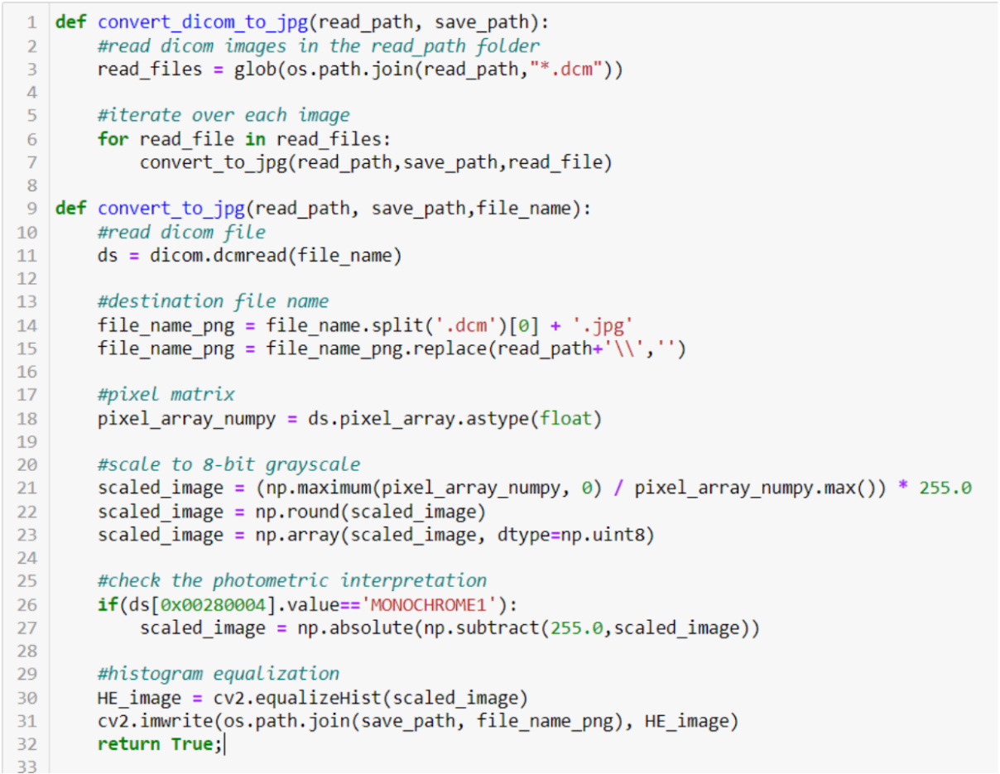
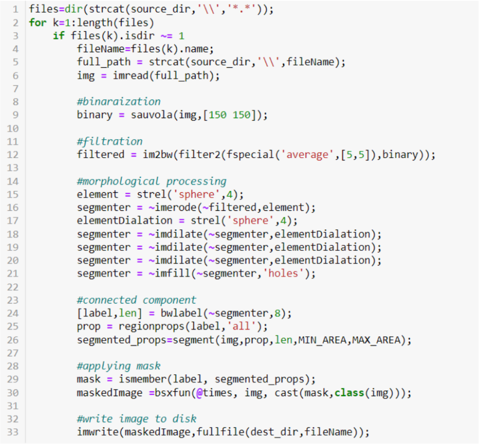
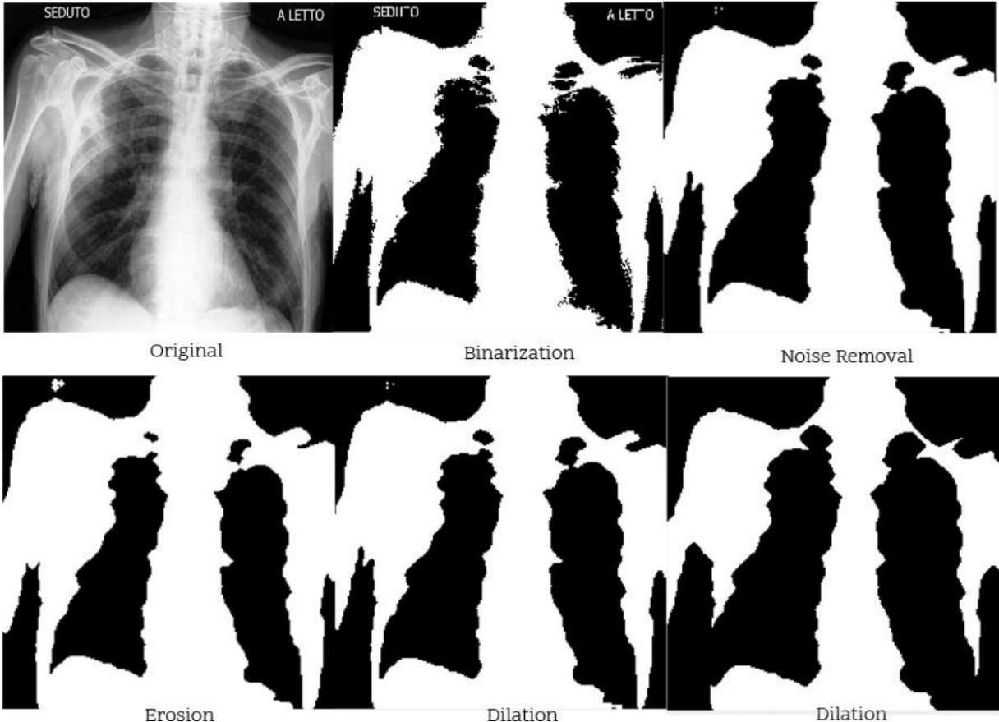
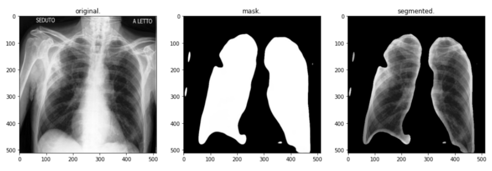
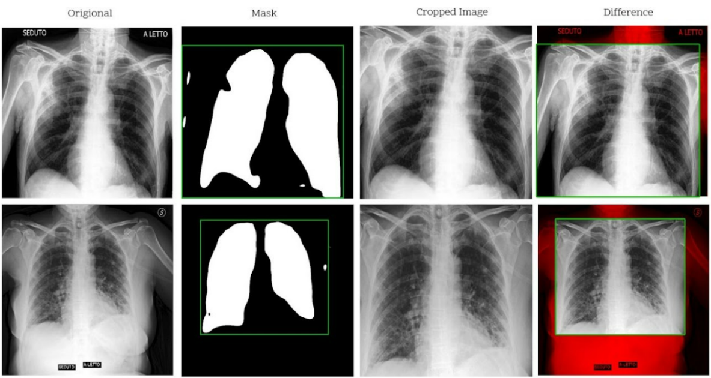
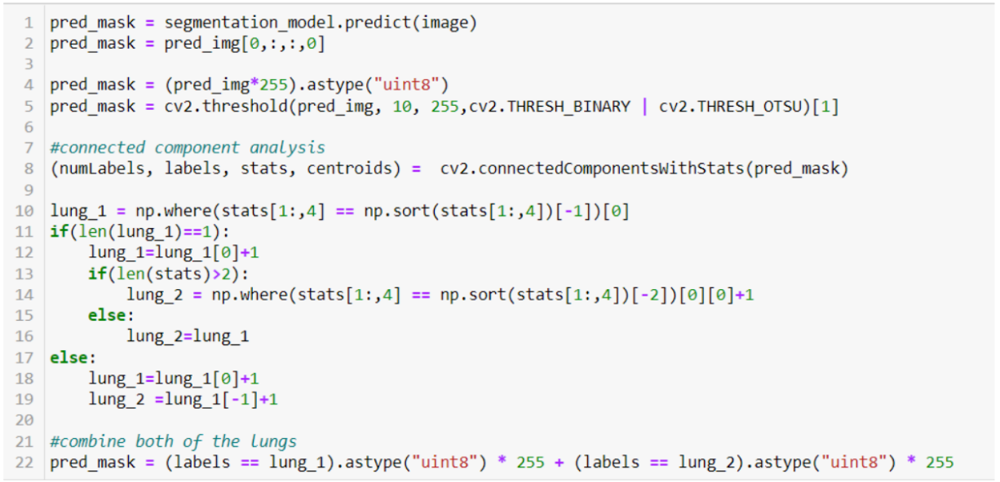
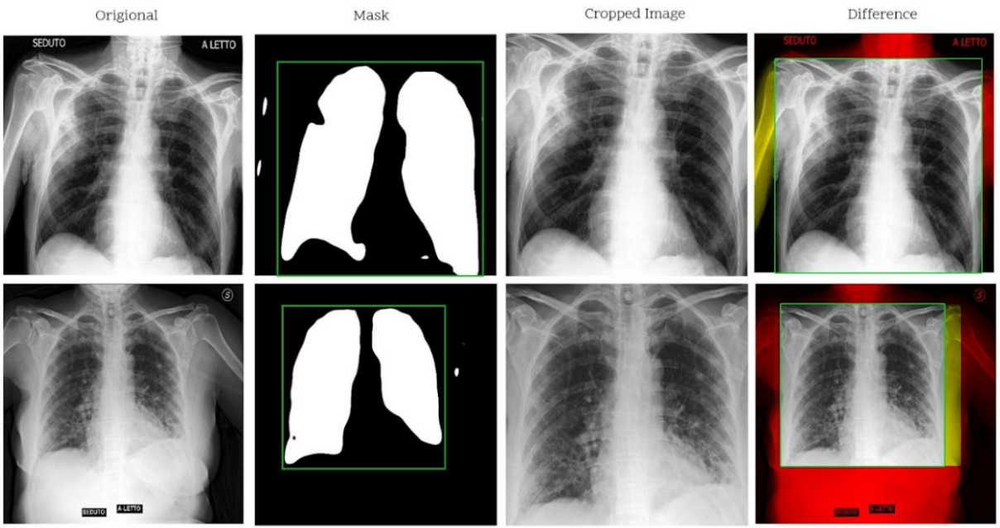

# Covid-19 Severity Classification
Since the dataset is imbalanced, we had to apply a balancing strategy. This is done so that the classification model is not biased towards the majority class. Data level approaches resample the dataset to ensure an equal class distribution. over-sampling minority class and under-sampling majority class are some of those approaches However, it is often better to maintain as much data as possible in medical classification. Weight balancing, on the other hand, modifies the loss function to assign a higher weight to the minority classes. The cost-sensitive learning methods deal with class imbalance. In this study, we chose to apply weight balancing. Figure 4.1 shows how the weight for each of the classes is calculated.

*Figure 4.1 Source code of class weight*

1. ## **Preprocessing and Normalization** 

Histogram equalization is an image enhancement technique used in this research. Additionally, size and format normalization are also applied to the whole dataset.

The photometric interpretation parameter of Digital Imaging and Communications in Medicine (DICOM) images helps in identifying if the image is in a negative model (MONOCROME1). By using this information, a linear transformation could be applied to convert it to the right form where the background is black and the foreground is white. Figure 4.3 shows the result of applying this transformation. 

  
*Figure 4.2 A negative (MONOCHROME1) image \- the left, converted image – the right*

When taking a sequence of x-ray images, it is usually administered with low exposure. This is done to minimize the amount of radiation delivered to the patients. Applying image enhancement techniques such as histogram equalization improves the quality of the images. Figure 4.3 shows the result of applying histogram equalization on the input chest x-ray image. On the left, it shows a histogram tally of the pixel values. As you can histogram values are concentrated around a pixel value of 80 applying histogram equalization stretches those values across all the value ranges resulting in an enhanced image (shown on the right of Figure 4.3). 

*Figure 4.3 The left graphs show the histogram of the image on the right.*

All the images are converted into JPEG file format from their original Digital Imaging and Communications in Medicine (DICOM) format. PyDICOM, NumPy, and OpenCV-2 are python libraries used for histogram equalization, size adjustment, and noise filtration. Figure 4.4 show the source code for doing the preprocessing and normalization. convert\_dicom\_to\_jpg accepts two parameters, read\_path and save\_path.  The source folder containing the images in format, and the destination folder where the result will be is passed to read\_path and save\_path parameters respectively. On line number three, all of the files in read\_path folder ending with ".dcm” are selected to be stored in an array from which convert\_to\_jpg function is iterated over. convert\_to\_jpg converts the DICOM image into a JEPG and applies histogram equalization. On line number 11, the image file loaded into memory. Line numbers 14 and 15 generate the file name to which the converted file is saved.  Line number 18 converts the image into a NumPy matrix. From line numbers 21-23 the matrix is rescaled into integer 0-255 by looking for maximum and minimum values in the matrix. Line number 26 checks if the image is in ‘MONOCHROME1’ and applies proper transformation. On line number 30 OpenCV-2 equalizeHist function is used to perform histogram equalization. Figure 4.3 shows the effect of applying histogram equalization on one of the chest x-rays images. Finally, the image is saved into a file at line number 31\. 

*Figure 4.4 Source code for preprocessing and normalization*

2. ##  **Segmentation**

In this study, thresholding-based techniques, deep learning-based, segmentation-based cropping, and modified segmentation-based cropping techniques are compared.

1. ### **Thresholding-Based Segmentation**

Thresholding-based segmentation finds intensity values that segment the background and the foreground image. Figure 4.5 shows the source code of thresholding-based segmentation. From line 1 to 6, the image files from source\_dir folder are loaded into memory. On line number 9 sauvola binarization is applied. On line number 12, the average noise filtration is applied. From line number 15 to 21 morphological processing is applied. The connected component is then analyzed. The most probable connected components are selected using the ‘segment’ function. Finally, the mask is applied to the original image and the resulting image is saved to a file.

*Figure 4.5 Thresholding-based segmentation source code*

The resulting mask for the lungs contains central areas where darker lung regions are present. The rib bones overlap around the out boundaries of the lung causing the area to appear brighter. This in turn forces the algorithm to consider it as a background as Sauvola highlights the inner region of the lung region. A sequence of morphological erosion and dilation is applied to grow and shrink these regions. Figure 4.6 shows the result of applying binarization, noise removal, and morphological operations. 

*Figure 4.6 Thresholding-based segmentation result*

2. ### **Deep Leaning-Based Segmentation**

A pre-trained u-net model is used to do the segmentation. Figure 4.7 shows the corresponding segmentation results. Using this method has some problems, it has a tendency to misclassify bright regions and produce small objects. Figure 4.7, for example, misclassified the lung region around the upper left corner of the left lung. Additionally produced small artifacts around the left arm and the heart.

*Figure 4.7 From left to right original image, generated mask, and final segmented image*

3. ### **Segmentation Based Cropping**

Segmentation-based cropping does not actually use the segmentation mask to segment the image instead it uses it to calculate a rectangle that will be used to crop the original image. Depending on the size and position of the patient more body parts (e.g., arms, neck, stomach) might be included in the Chest x-ray image. The inclusion of these body parts and the extra information inscribed on the corners of the chest x-ray images might affect the classification model. Segmentation-based cropping was designed to remove these unwanted variations.  Figure 4.8 shows two chest x-rays cropped using the semination-based cropping technique.  In the second column, we can see how the rectangle is dawn. In the next column, the cropped image is depicted. Finally, the difference between the cropped image and the original is shown in the last column. Using this approach, it can be seen that both of the lung regions are contained in the image while avoiding unwanted regions of the image (i.e., the text, and arm bones).  
  
*Figure 4.8 Result of segmentation-based cropping*  
Segmentation-based cropping technique does perform in making sure no information is lost by the segmentation mask. However, we have noticed that an artifact in the segmentation mask does force the cropping to include unwanted regions of the chest x-ray. In Figure 4.8, For example, two white spots on the left of the first mask, expanded the cropping rectangle causing it to include the Humerus bond of the right arm. Additionally, in the second image, another artifact on the right side caused it to unnecessarily expand to the right. To overcome this problem, we modified the cropping algorithm to drop needless spots on the mask.

Figure 4.9 shows how the segmentation-based cropping is modified. The image is first fed into the segmentation model to produce pred\_mask. Since the output is in form of an array it is converted into a single image format on line number 2\. On line number 4 the image is converted from a floating-point value between zero and one to a standard 8-bit format. On line 5, the image is converted back to a binary image as this is the proper input for the connected component analysis done on line number 8\. 

*Figure 4.9 Source code of modification of segmentation-based cropping*

OpenCV-2’s connectedComponentWithStats function accepts a binary image and produces a list of connected components with their properties. numLables is the number of connected components. It should be noted that OpenCV-2 considers the original image as the first connected component. lables is a matrix of the connected component where the elements correspond to the connected component number. Stats is Statistical properties of the connected components. It includes the area of the connected components, and, the width and height of the bounding box with its left and right-most points. Centroids are the average of x and y coordinates of all the elements in each of the connected components. It is in array format where the index corresponds to the label. We used the area property of stats variable to compare and select lung masks. It is located in the fifth column. So it is addressed as stats\[1:,4\]. The number one and colon here is to remove the first connected component as it is the original image. On line number 10 to 19 two of the largest connected components are assigned lung\_1 and lung\_2. Finally, two of the largest connected components are merged on line number 22\. The full source code for the segmentation-based cropping and its modified version can be found in Appendix 1 and Appendix 2\.

The white spots, as shown in Figure 4.10, no longer affect the cropping rectangle. The different regions are colored red and yellow to show how cropping differs between both the original and segmentation-based cropping techniques.

*Figure 4.10 result of modified segmentation-based cropping*

This repository contains the notebook and files used to develop the model discussed in the thesis titled "Covid-19 Severity Classification Using Hybrid Feature Extraction Techniques" 
The model was developed to classify the severity of covid-19 from chest X-ray images. It utilizes a hybrid approach combining convolutional neural networks, vision transformers, and persistent homology.
Files
 - "Copy of coatnet lung severity score classification on minimized and non segemented" and "coatnet lung severity score classification on minimized and non segemented": These files likely contain variations of the CoatNet model applied to classify COVID-19 severity. One variation may use segmented lung images as input, while the other may use the full chest X-ray images without segmentation.

- "PH for image.ipynb" and "PH_Feature_to_files.ipynb": These Jupyter Notebook files probably pertain to the extraction and processing of persistent homology features from the images. "PH for image.ipynb" might contain the code for calculating persistent homology from individual images, while "PH_Feature_to_files.ipynb" could be responsible for extracting these features for the entire dataset and saving them to files.
- "coatnet lung severity score classification": This file could contain the implementation of the CoatNet model for classifying COVID-19 severity, potentially utilizing the segmented lung images.
- "metadata_consensus_v1.xlsx" and "metadata_global_v2.xlsx": These spreadsheet files likely contain metadata associated with the chest X-ray images used in the study. They might include information such as patient demographics, image acquisition parameters, and severity labels provided by radiologists.
- "modified combined model.ipynb": This Jupyter Notebook file likely contains the implementation of the final proposed model, which combines the CoatNet features with the persistent homology features. The notebook might detail the model architecture, training process, and evaluation results.
- "u-net-lung-segmentation-montgomery-shenzhen.ipynb": This Jupyter Notebook file probably contains the implementation of the U-Net model used for segmenting the lung regions from the chest X-ray images. It might include the code for training, evaluating, and utilizing the U-Net model for segmentation.

The file list suggests a structured approach to developing the COVID-19 severity classification model. The presence of files related to persistent homology, CoatNet, U-Net segmentation, and a combined model indicates a comprehensive implementation of the hybrid approach discussed in the thesis.
